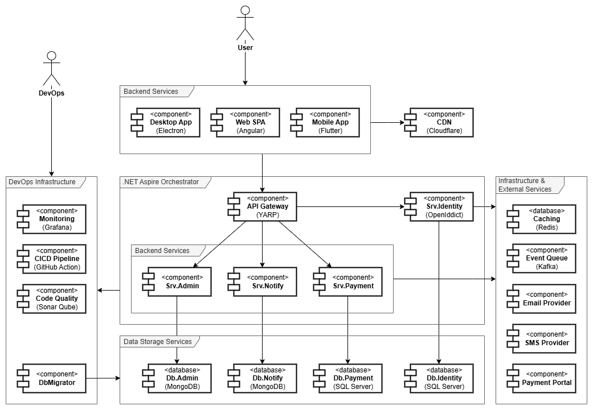

# Microservice Software Architecture

This document outlines the architecture of a robust, extensible microservice boilerplate designed for distributed applications with the .NET ecosystem and Angular SPA frontend. The boilerplate aims to accelerate project initiation, enforce best practices, and cover common architectural concerns, serving as the foundation for scalable Software-as-a-Service solutions.

## Objectives
- Rapid Project Kickoff: Minimize configuration and manual setup for new microservice projects.
- Extensibility: Enable easy addition of new services and features.
- Consistency: Apply proven patterns for maintainable, scalable solutions.
- Modern Technology Stack: Leverage industry-leading frameworks and cloud services.
- Out-of-the-Box Operations: Integrate testing, CI/CD, monitoring, and documentation.

## High-Level Architecture

| Categories        | Features                              | Technology                                                    |
|-------------------|---------------------------------------|---------------------------------------------------------------|
| **Frontend**      | Web Application                       | Angular (SPA), Themed UI, Localization                        |
| **Frontend**      | Mobile Application                    | Flutter (Android & iOS), Themed UI, Localization              |
| **Frontend**      | Desktop Application                   | Electron (Cross-Platform), Themed UI, Localization            |
| **Microservices** | API Gateway                           | YARP (Reverse Proxy), gRPC                                    |
| **Microservices** | Identity Service                      | OpenIddict (OpenID Connect, OAuth2)                           |
| **Microservices** | Domain Services                       | .NET Aspire, Modular DDD/EDD/TDD structure                    |
| **Database**      | Relational DB (Identity & Payment)    | SQL Server (Entity Framework Core)                            |
| **Database**      | Document DB (Admin & Notifications)   | MongoDB (MongoDB.Driver)                                      |
| **Communication** | Synchronous                           | Restful API, gRPC, YARP (HTTP Routing)                        |
| **Communication** | Asynchronous                          | Kafka (Event-Driven) - Broker & Mediator Patterns             |
| **Communication** | Realtime Communication                | SignalR (Realtime)                                            |
| **Features**      | External Notifications                | SMTP, Twilio, SendGrid (Pluggable Providers)                  |
| **Features**      | Multi-tenancy                         | Custom Tenant Context, Tenant-Isolated Databases, SaaS Pattern|
| **Features**      | Payment & Subscription                | Stripe/PayPal SDKs, Subscription Workflow                     |
| **DevOps**        | Monitoring/Telemetry                  | .NET Aspire Dashboards, OpenTelemetry, Kibana, Elasticsearch  |
| **DevOps**        | Continuous Integration (CI)           | GitHub Actions, Azure DevOps, SonarQube, CodeQL               |
| **DevOps**        | Continuous Delivery (CD)              | GitHub Actions, Docker, Kubernetes, Portainer                 |

#### 1. Design and Implementation Principles
- Each business capability is encapsulated in a dedicated service.
- Follows DDD: Bounded Contexts and Aggregates per module.
- Follows EDD: Event Driven Design with Message Brokers and Mediators.
- Follows TDD: Unit, Integration, and End-to-End tests for each service.
- Clean separation of infrastructure, domain, and application layers.

#### 2. Multi-Tenancy & Software as a Service (SaaS)
- Tenant context propagation via HTTP headers and claims.
- Data isolation: schema-per-tenant, partitioning, or row-level security (configurable).
- Subscription management, payment integration for tenant lifecycle.

#### 3. Inter and Outer Communication
- Centralized entry point for all client apps with API Gateway.
- Request routing via YARP (Reverse Proxy).
- Supports HTTP REST and gRPC for service-to-service communication.
- Kafka for asynchronous service communication, domain events, and integration events.

#### 4. Authentication & Authorization
- OpenIddict provides OIDC flows, external identity provider integration (Azure AD, Google, etc.).
- Single Sign-On (SSO) across tenants and applications.
- Role, permission, and policy-based access control.

#### 5. Notification System
- SignalR for in-app push notifications (websocket).
- Pluggable email/SMS providers for external messaging.
- Notification templates and localization.

#### 6. Observability & Monitoring
- Aspire dashboards for health, metrics, and traces.
- Distributed tracing and logging (OpenTelemetry, Serilog).
- Integration with Grafana, Azure Monitor.

#### 7. Testing & CI/CD
- TDD-first approach: xUnit/NUnit for services, Cypress/Playwright for frontend.
- Automated code quality and security scans (SonarQube, Snyk).
- GitHub Actions for build, test, deploy pipelines.
- Containerization via Docker, Azure deployments via IaC.

## Guideline Documentation

- **Getting Started:** Step-by-step guide to bootstrap new projects.
- **Usage Examples:** End-to-end workflow samples (tenant registration, payment, notification).
- **Add New Service:** Scaffold via boilerplate template, register with gateway, configure event topics.
- **Integrate Provider:** Use pluggable interface adapters (payment, notification, auth).
- **Customize Frontend:** Theming and localization via Angular modules and configuration.
- **Extend Domain Logic:** DDD aggregates, domain events, and service boundaries.
- **API Reference:** OpenAPI specs, gRPC proto files, event contracts.
- **Best Practices:** DDD, EDD, TDD, modularization, cloud-native deployment.
- **Troubleshooting:** Common pitfalls, debugging, upgrade paths.

## Future Enhancements

- Support for additional frontend frameworks (React, Blazor).
- Pluggable AI services (recommendation, analytics).
- Multi-cloud deployment options.
- Advanced tenancy features (custom domains, per-tenant configuration).

## References

- [.NET Aspire Documentation](https://learn.microsoft.com/en-us/dotnet/aspire/)
- [OpenIddict Documentation](https://documentation.openiddict.com/)
- [YARP Reverse Proxy](https://microsoft.github.io/reverse-proxy/)
- [Kafka Documentation](https://kafka.apache.org/documentation/)
- [Angular Internationalization](https://angular.io/guide/i18n)
- [Azure Cloud Native Services](https://azure.microsoft.com/en-us/solutions/cloud-native/)
- [GitHub Actions](https://docs.github.com/en/actions)